# College Compass AI Chatbot 🎓

> **An AI-powered full-stack college discovery and comparison platform built with Next.js, TypeScript, Prisma ORM, PostgreSQL, JWT Authentication, and Gemini AI.**

College Compass helps students discover, compare, and evaluate engineering colleges across India. The platform provides detailed college information, AI-powered assistance, student reviews, favorites, and side-by-side comparisons to help students make informed decisions.

---

## 🚀 Live Demo

🌐 **Live Website:** https://college-compass-kappa.vercel.app

---

## 🌟 Highlights

- 🤖 AI-powered college assistant using Gemini
- 🏛️ Explore 1200+ engineering colleges
- ⚖️ Side-by-side college comparison
- ❤️ Save & manage favorite colleges
- ⭐ Student reviews and ratings
- 📍 Google Maps integration
- 🔐 Secure JWT Authentication
- 📱 Fully responsive modern UI

---

# ✨ Features

## 🔍 College Discovery

- Browse engineering colleges across India
- Search colleges by name
- Responsive college cards
- Detailed college information page

## ⚖️ College Comparison

- Compare two colleges side-by-side
- Compare:
  - Fees
  - Ratings
  - NIRF Rankings
  - Average Package

## 🤖 AI Chatbot

Powered by **Google Gemini AI**

Supports queries like:

- Best colleges for CSE
- Colleges under a specific budget
- Compare colleges
- Explain NIRF Rankings
- Placement-related questions
- General college guidance

## ❤️ Saved Colleges

- Save favorite colleges
- Remove saved colleges
- Persistent saved list

## ⭐ Student Reviews

- Add reviews
- Delete your own reviews
- Average user rating
- Review count

## 📍 Additional Features

- Similar Colleges
- Google Maps Integration
- Google Search Shortcut
- FAQ Section
- About Page
- Contact Page
- Responsive Landing Page

## 🔐 Authentication

- User Signup
- User Login
- JWT Authentication
- Password Hashing using bcryptjs

---

# 🛠 Tech Stack

## Frontend

- Next.js
- React
- TypeScript
- Tailwind CSS

## Backend

- Next.js API Routes
- Prisma ORM

## Database

- PostgreSQL (Neon)

## Authentication

- JWT
- bcryptjs

## AI

- Google Gemini API

## Deployment

- Vercel

---

# 📂 Project Structure

```text
src
├── app
│   ├── about
│   ├── api
│   │   ├── ai
│   │   ├── auth
│   │   ├── colleges
│   │   ├── reviews
│   │   └── saved-colleges
│   ├── college
│   ├── compare
│   ├── contact
│   ├── login
│   ├── recommend
│   ├── saved-colleges
│   ├── signup
│   ├── favicon.ico
│   ├── globals.css
│   ├── layout.tsx
│   └── page.tsx
│
├── components
│   ├── college
│   │   ├── AddReviewForm.tsx
│   │   ├── CollegeCard.tsx
│   │   ├── CollegeList.tsx
│   │   ├── CompareColleges.tsx
│   │   ├── DeleteReviewButton.tsx
│   │   ├── SaveCollegeButton.tsx
│   │   └── SearchBar.tsx
│   │
│   ├── home
│   │   ├── Categories.tsx
│   │   ├── FAQ.tsx
│   │   ├── Features.tsx
│   │   └── Stats.tsx
│   │
│   ├── layout
│   │   └── Footer.tsx
│   │
│   ├── AIChatWidget.tsx
│   └── NavBar.tsx
│
├── generated
├── lib
│   ├── jwt.ts
│   └── prisma.ts
│
├── types
└── middleware.ts
```

---

# 📸 Screenshots

## 🏠 Home Page

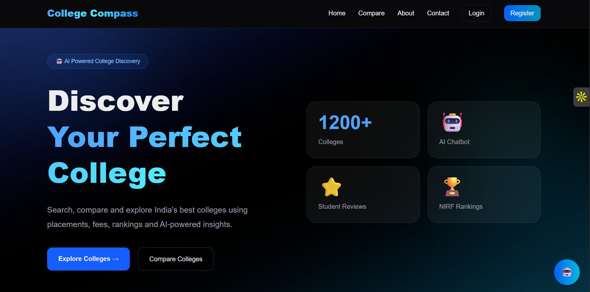

---

## 🤖 College Compass AI Assistant

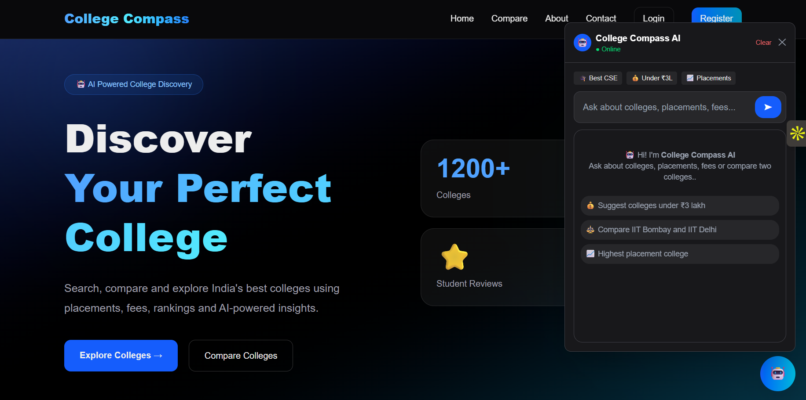

---

## 💬 AI Chatbot in Action

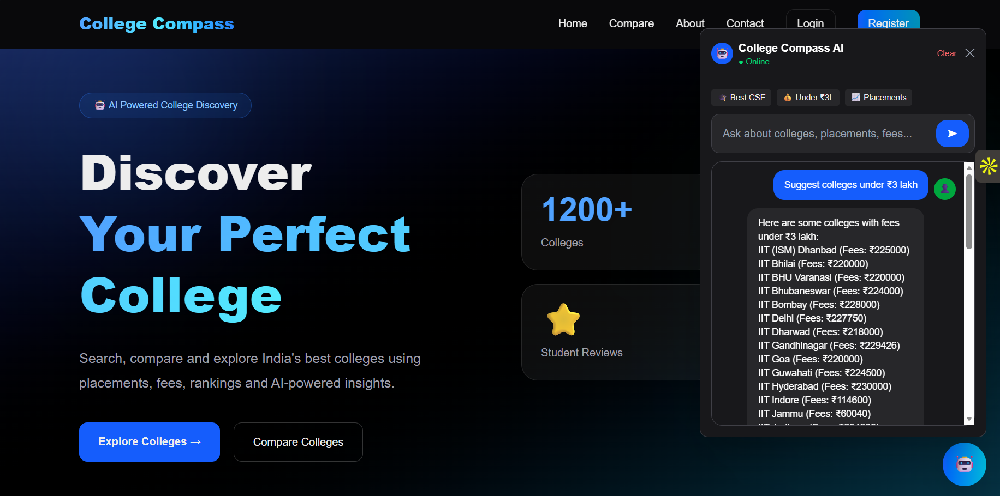

---

## 🔍 Search Colleges

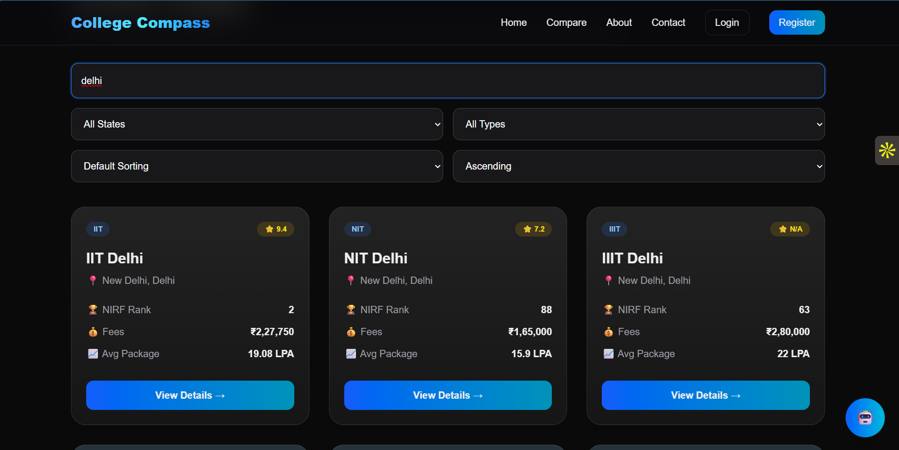

---

## ⚖️ Compare Colleges

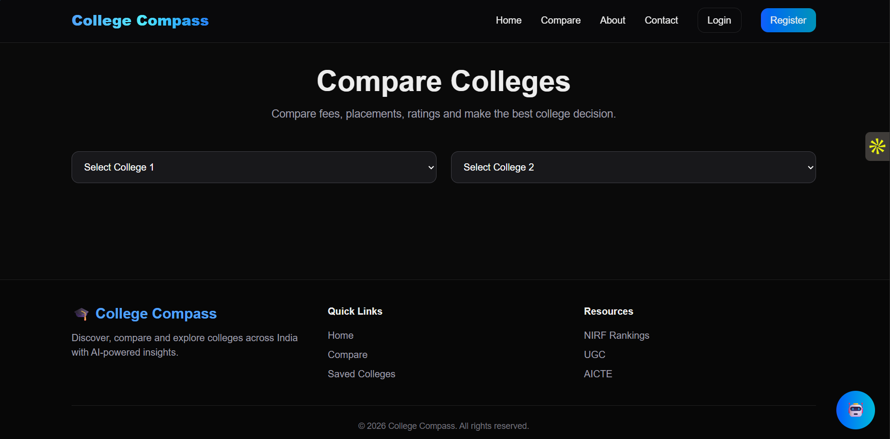

---

## 📊 Comparison Result

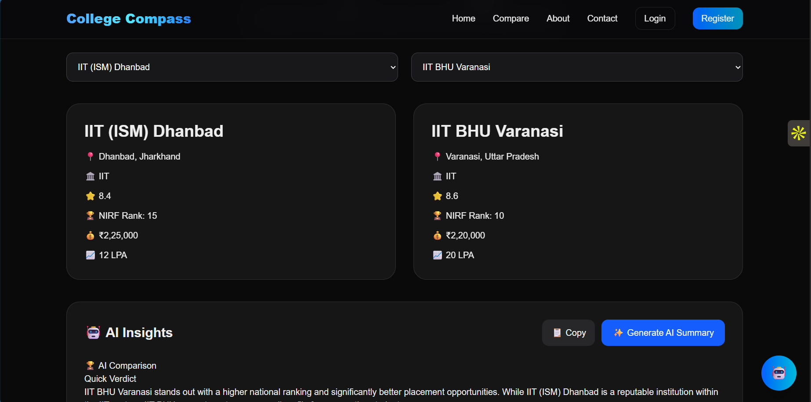

---

## 🏛 College Details

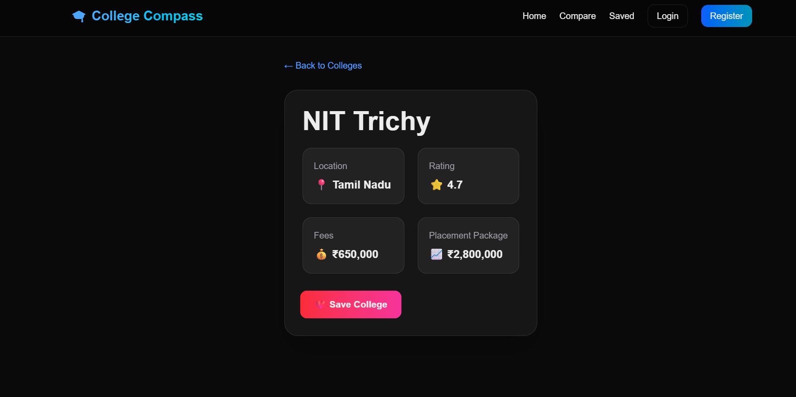

---

## ❤️ Saved Colleges

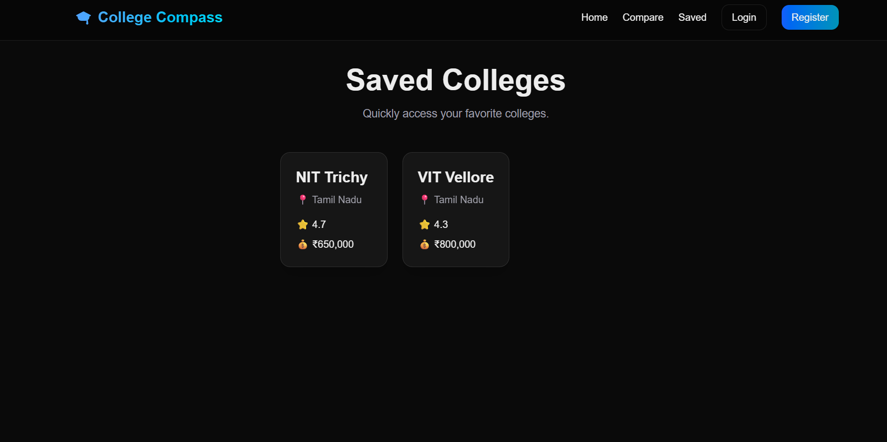

---

## ⭐ Student Reviews

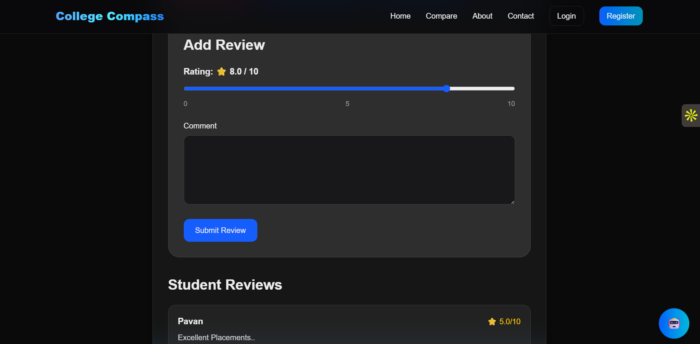

---

## 🏫 Similar Colleges

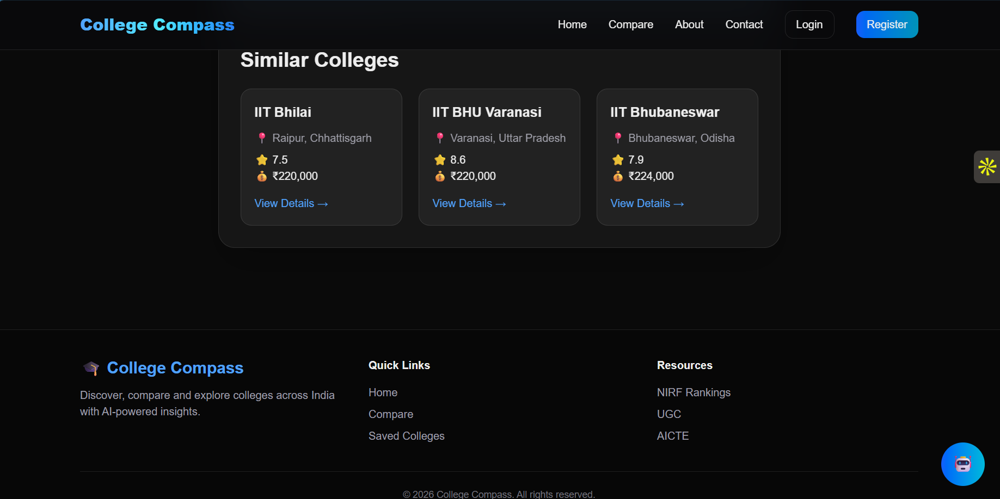

---

## ℹ️ About Page

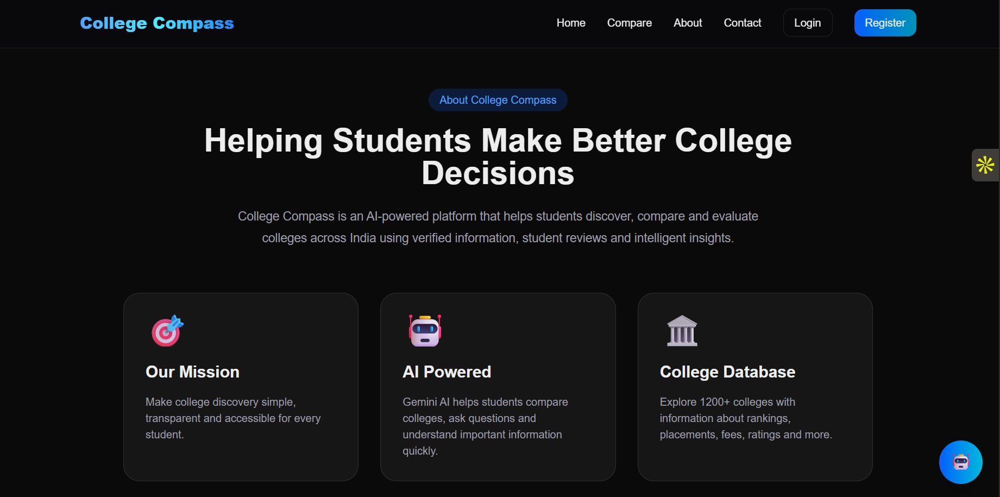

---

## 📞 Contact Page

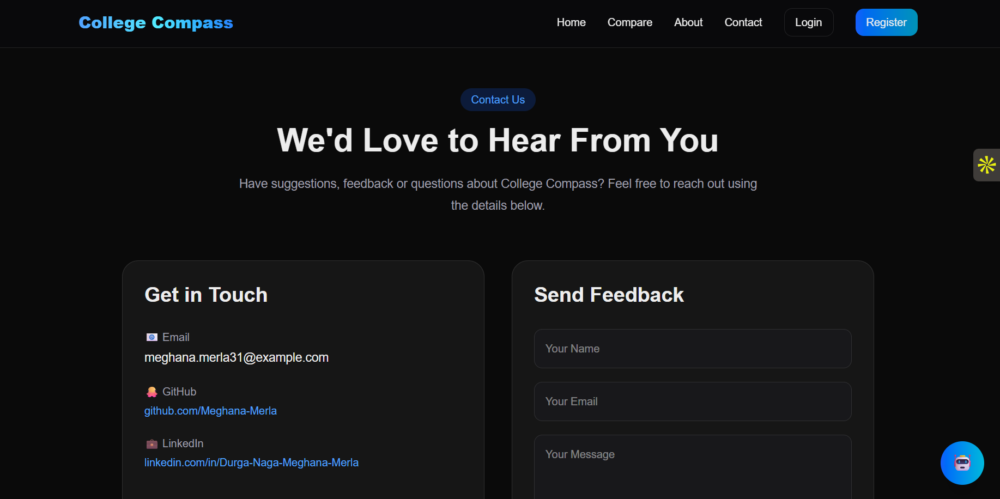

---

## ❓ FAQ Section

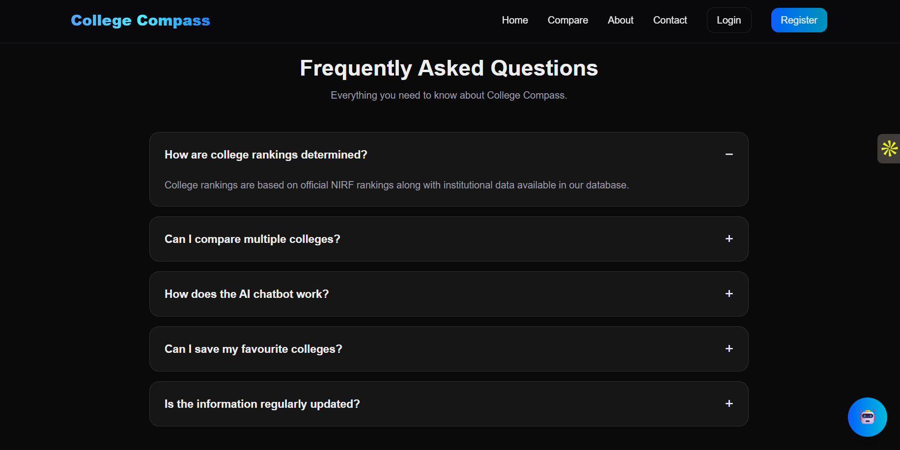

---

## 🔐 Login Page

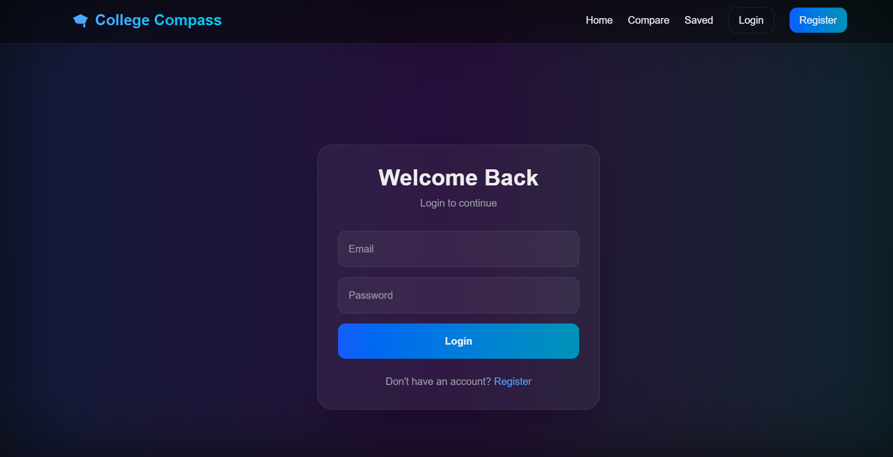

---

## 📝 Register Page

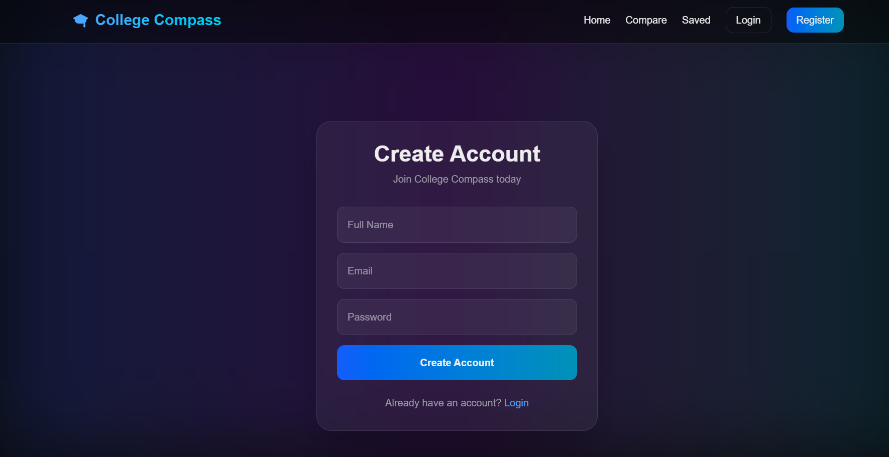

---

# ⚙️ Installation

Clone the repository

```bash
git clone https://github.com/Meghana-Merla/college-compass.git
```

Move into the project

```bash
cd college-compass
```

Install dependencies

```bash
npm install
```

Create a `.env` file

```env
DATABASE_URL=your_database_url

JWT_SECRET=your_secret_key

GEMINI_API_KEY=your_gemini_api_key
```

Generate Prisma Client

```bash
npx prisma generate
```

Run database migrations

```bash
npx prisma migrate deploy
```

Start the development server

```bash
npm run dev
```

---

# 📡 API Endpoints

## 🔐 Authentication

```http
POST /api/auth/signup
```

Register a new user.

```http
POST /api/auth/login
```

Authenticate user and generate JWT.

```http
POST /api/auth/logout
```

Logout the authenticated user.

```http
GET /api/auth/me
```

Returns the currently authenticated user.

---

## 🏛 Colleges

```http
GET /api/colleges
```

Fetch all colleges.

---

## ❤️ Saved Colleges

```http
GET /api/saved-colleges
```

Fetch saved colleges of the logged-in user.

```http
POST /api/saved-colleges
```

Save a college.

```http
DELETE /api/saved-colleges
```

Remove a saved college.

---

## ⭐ Reviews

```http
POST /api/reviews
```

Add a review for a college.

```http
DELETE /api/reviews
```

Delete a review.

---

## 🤖 College Compass AI Assistant

```http
POST /api/ai
```

Ask college-related questions using the Gemini AI assistant.

---

# 🎯 Future Improvements

- AI College Recommendation Engine
- AI Compare Summary
- Placement Analytics & Charts
- Admin Dashboard
- Profile Management
- Loading Skeletons
- SEO Optimization
- PWA Support

---

# 👨‍💻 Author

**Meghana Merla**

GitHub: https://github.com/Meghana-Merla

---

## ⭐ If you like this project

Give this repository a ⭐ on GitHub!
