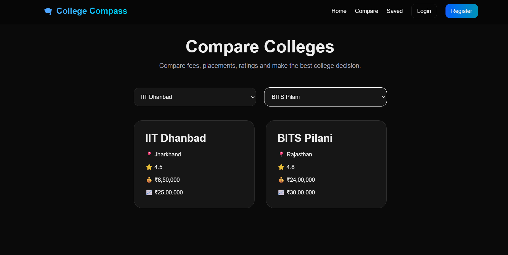

# College Compass 🎓

A full-stack college discovery and comparison platform built with Next.js, TypeScript, Prisma ORM, PostgreSQL, and JWT Authentication.

## 🚀 Live Demo

**Live URL:** https://college-compass-kappa.vercel.app

---

## ✨ Features

### College Discovery
- Browse colleges with detailed information
- Search colleges by name
- View college details
- Compare colleges side by side

### Authentication
- User Signup
- User Login
- JWT-based Authentication
- Secure password hashing using bcryptjs

### Saved Colleges
- Save favorite colleges
- View saved colleges

---

## 🛠 Tech Stack

### Frontend
- Next.js 
- React
- TypeScript
- Tailwind CSS

### Backend
- Next.js API Routes
- Prisma ORM

### Database
- PostgreSQL (Neon)

### Authentication
- JWT
- bcryptjs

### Deployment
- Vercel

---

## 📂 Database Schema

### User
- id
- name
- email
- password

### College
- id
- name
- location
- fees
- rating
- placements

### Course
- id
- name
- duration

### Review
- id
- rating
- comment

### SavedCollege
- userId
- collegeId

---

## 📸 Screenshots

### Home Page


### Search Colleges


### Compare Colleges


### Comparison Result



### College Details


### Login Page


### Register Page


### Saved Colleges


---

## ⚙️ Installation

Clone the repository:

```bash
git clone https://github.com/Meghana-Merla/college-compass.git
cd college-compass
```

Install dependencies:

```bash
npm install
```

Create a `.env` file:

```env
DATABASE_URL=your_database_url
JWT_SECRET=your_secret_key
```

Generate Prisma Client:

```bash
npx prisma generate
```

Run migrations:

```bash
npx prisma migrate deploy
```

Start development server:

```bash
npm run dev
```

---

## 📡 API Endpoints

### Authentication

```http
POST /api/auth/signup
POST /api/auth/login
```

### Colleges

```http
GET /api/colleges
```

### Saved Colleges

```http
POST /api/saved-colleges
GET /api/saved-colleges
```

---

## 🎯 Future Improvements

- Advanced Filters
- College Reviews System
- User Profile Page
- Better UI/UX
- Mobile Optimization
- Toast Notifications

---

## 👨‍💻 Author

**Meghana Merla**
